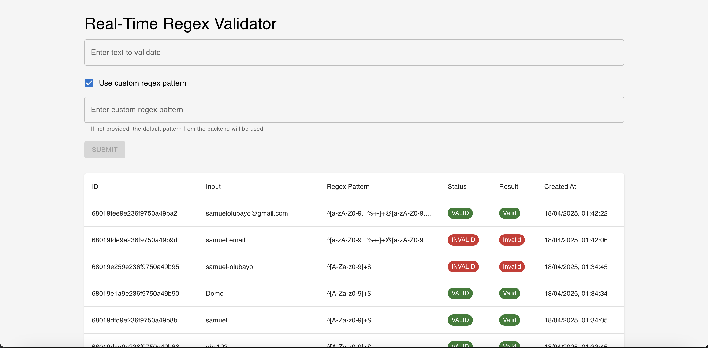

# Real-Time Regex Validator Frontend

This is the frontend application for the Real-Time Regex Validator, a tool that allows users to test string patterns against regular expressions in real-time.



## Technologies Used

- **React** - JavaScript library for building user interfaces
- **TypeScript** - Typed superset of JavaScript
- **Material UI** - React component library implementing Google's Material Design
- **Axios** - Promise-based HTTP client
- **Socket.IO** - Library for real-time web applications
- **React Testing Library** - Testing utilities for React

## Prerequisites

- Node.js (v18.x or higher)
- Backend API running (see backend README)

## Project Structure

```
frontend/
├── public/              # Static files
├── src/
│   ├── components/      # React components
│   │   ├── JobForm.tsx  # Form for creating new validation jobs
│   │   └── JobList.tsx  # List of validation jobs
│   ├── services/        # API services
│   │   └── api.ts       # API client for communicating with backend
│   ├── types/           # TypeScript type definitions
│   │   └── job.ts       # Job-related types
│   ├── App.tsx          # Main application component
│   └── index.tsx        # Application entry point
├── docs/
│   └── images/          # Documentation images
├── .env                 # Environment variables
├── package.json         # Dependencies and scripts
└── tsconfig.json        # TypeScript configuration
```

## Installation

1. Clone the repository
2. Navigate to the frontend directory
3. Install dependencies:

```bash
npm install
```

## Environment Variables

Create a `.env` file in the root of the frontend directory with the following variables:

```
REACT_APP_API_URL=http://localhost:3000
```

### Environment Variables Explanation:

- `REACT_APP_API_URL`: URL of the backend API server

## Running the Application

### Development Mode

```bash
npm start
```

This will start the application in development mode on [http://localhost:3001](http://localhost:3001).

### Production Build

```bash
npm run build
```

This will create an optimized production build in the `build` directory.

## Features

### Regex Validation

1. Enter a text string to validate
2. Optionally specify a custom regex pattern or use the default from the server
3. Submit the job for validation
4. See real-time updates as the job is processed
5. View a history of validation jobs

### Custom Regex Pattern

The application allows users to:

- Use the default regex pattern from the backend, or
- Specify a custom regex pattern for validation

### Real-Time Updates

Validation results are updated in real-time using WebSockets, with no need to refresh the page.

## Components

### JobForm

The `JobForm` component allows users to:

- Enter text to validate
- Toggle between default and custom regex patterns
- Enter a custom regex pattern when enabled
- Submit the job for validation

```jsx
<JobForm onJobCreated={fetchJobs} />
```

### JobList

The `JobList` component displays a table of all validation jobs, including:

- Input text
- Regex pattern used
- Validation status
- Result (valid/invalid)
- Timestamp

```jsx
<JobList jobs={jobs} />
```

## API Integration

The application communicates with the backend API using the `api.ts` service:

- `createJob(input, regexPattern?)`: Creates a new validation job
- `getJobs()`: Retrieves all validation jobs
- `getJob(id)`: Retrieves a specific job by ID

## WebSocket Integration

The application establishes a WebSocket connection to receive real-time updates:

```javascript
const socket = io(SOCKET_URL);
socket.emit("subscribe");
socket.on("job-update", (update) => {
  // Update UI with the latest job status
});
```

## Testing

Run the test suite:

```bash
npm test
```

Run with coverage:

```bash
npm test -- --coverage
```

## Example Regex Patterns

Here are some useful regex patterns to try in the application:

### Email Validation

```
^[a-zA-Z0-9._%+-]+@[a-zA-Z0-9.-]+\.[a-zA-Z]{2,}$
```

### URL Validation

```
^(https?:\/\/)?(www\.)?[-a-zA-Z0-9@:%._\+~#=]{2,256}\.[a-z]{2,6}\b([-a-zA-Z0-9@:%_\+.~#?&//=]*)$
```

### US Phone Number

```
^\(?([0-9]{3})\)?[-. ]?([0-9]{3})[-. ]?([0-9]{4})$
```

### Date in YYYY-MM-DD Format

```
^\d{4}-(0[1-9]|1[0-2])-(0[1-9]|[12][0-9]|3[01])$
```

### Strong Password

```
^(?=.*[a-z])(?=.*[A-Z])(?=.*\d)(?=.*[@$!%*?&])[A-Za-z\d@$!%*?&]{8,}$
```

## Building and Deployment

### Docker

A `Dockerfile` is provided for containerization:

```bash
docker build -t regex-validator-frontend .
docker run -p 80:80 regex-validator-frontend
```

### Static Hosting

The production build can be deployed to any static hosting service:

1. Create a production build: `npm run build`
2. Deploy the contents of the `build` directory to your hosting provider

## Troubleshooting

### API Connection Issues

If the frontend cannot connect to the backend:

1. Verify the `REACT_APP_API_URL` environment variable is correct
2. Ensure the backend server is running
3. Check for CORS issues (the backend should allow requests from the frontend origin)

### WebSocket Connection Issues

If real-time updates are not working:

1. Ensure the backend WebSocket server is running
2. Check browser console for WebSocket connection errors
3. Verify network connectivity between frontend and backend

## License

[MIT](LICENSE)
